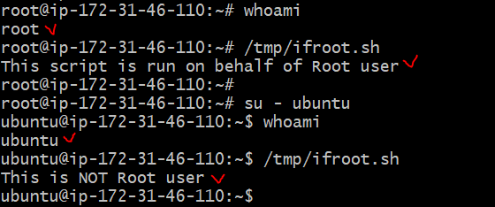

## Задача:

**1.1. Написать скрипт определяющий запущен ли скрипт от имени пользователя root**

## Решение:

nano /tmp/ifroot.sh

```
#!/bin/bash
set -euo pipefail
USER=root
if [ whoami == "$USER" ]; then
    echo "This script is run on behalf of $USER user";
else
    echo "This is NOT $USER user";
fi  
```

## Результат:



