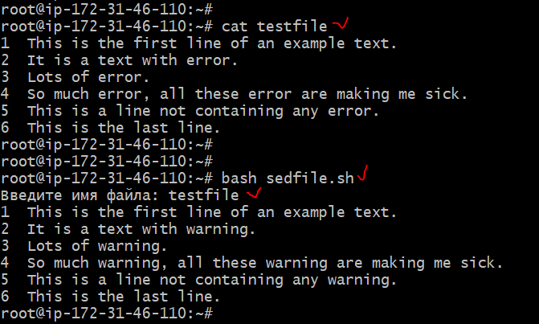

## Задача:

**Написать скрипт, который запрашивает у пользователя имя файла и заменяет вхождения строки error строкой warning.Если файла не существует, вывести сообщение об ошибке**

## Решение:

nano sedfile.sh

```
#!/bin/bash
set -euo pipefail
echo -n "Введите имя файла: "; read -r FILENAME; 
if [ -f "$FILENAME" ]
then
    sed 's/error/warning/g' "$FILENAME"
else
    echo "Файла не существует"
fi
```

## Результат:




