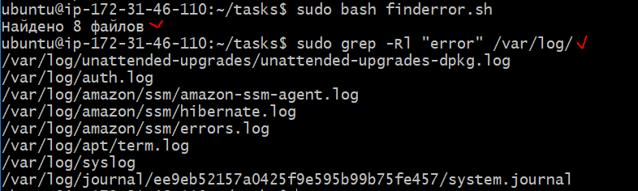

## Задача:

**Написать скрипт, который ищет файлы по заданному шаблону: все файлы содержащие текст error в каталоге с логами /var/log. Если файлы не найдены, вывести сообщение об ошибке**

## Решение:

nano finderror.sh

```
#!/bin/bash
set -euo pipefail

function check {
    grep -Rl "error" /var/log/ > /dev/null
    echo $?
}

RETVAL=$(check)

if [ "$RETVAL" != 0 ]
then
    echo "Файла не существует"
else
    count=$(grep -Rl "error" /var/log/ | wc -l) 
    echo "Найдено $count файлов"
fi
```

## Результат:


