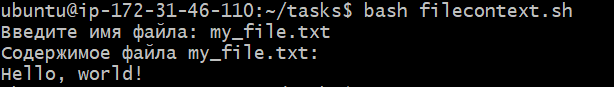

## Задача:

**1.7. Написать скрипт, который запрашивает у пользователя имя файла и выводит его содержимое.**
```
Введите имя файла: my_file.txt
Содержимое файла my_file.txt: 
Hello, world!
```

## Решение:

nano filecontext.sh

```
#!/bin/bash
set -euo pipefail
echo -n "Введите имя файла: "; read -r FILENAME; 
if [ -f "$FILENAME" ]
then
    echo "Содержимое файла $FILENAME: "
    cat "$FILENAME"
else
    echo "Файла не существует"
fi
```

## Результат:



