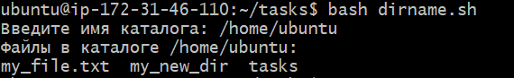

## Задача:

**Написать скрипт, который запрашивает у пользователя имя каталога и выводит список файлов в нем.**
```
Введите имя каталога: /home/user
Файлы в каталоге /home/user:
my_file.txt
my_other_file.txt
```
## Решение:

nano dirname.sh

```
#!/bin/bash
set -euo pipefail
echo -n "Введите имя каталога: "; read dirname;
if [ -d "$dirname" ] 
then
    echo "Файлы в каталоге $dirname:"
    ls "$dirname"
else
    echo "Каталога не существует"
fi
```

## Результат:



