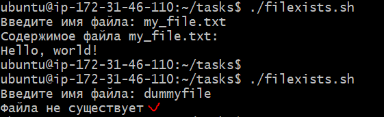

## Задача:

**Написать скрипт, который запрашивает у пользователя имя файла и выводит его содержимое. Если файла не существует, вывести сообщение об ошибке.**

## Решение:

nano filexists.sh

```
#!/bin/bash
set -euo pipefail
echo -n "Введите имя файла: "; read -r FILENAME; 
if [ -f "$FILENAME" ]
then
    echo "Содержимое файла $FILENAME: "
    cat "$FILENAME"
else
    echo "Файла не существует"
fi
```

## Результат:




