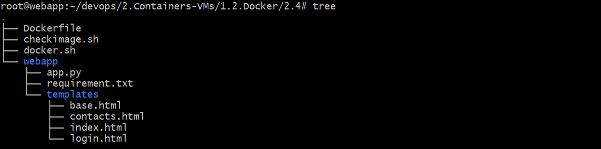
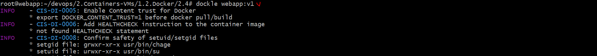
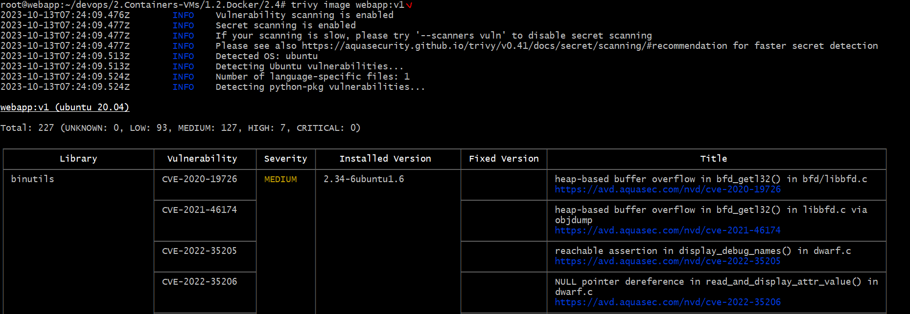
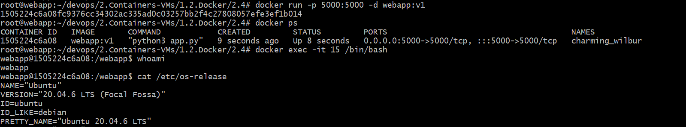
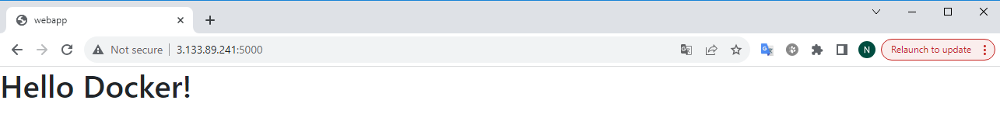
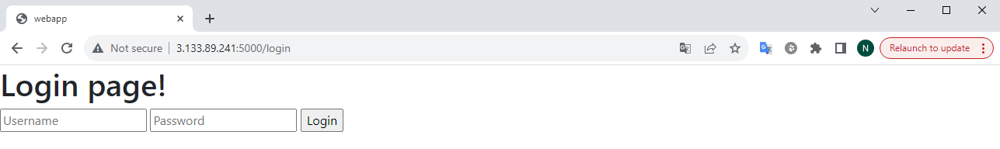
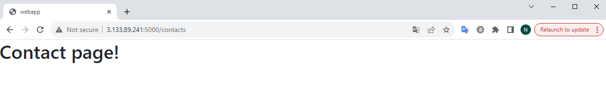

## Задача:

**2.4: Создание и запуск контейнера с веб-приложением в Docker**

> Цель этой задачи - ознакомиться с Docker, его основными командами и создать контейнер с простым веб-приложением.
>
> - Установка Docker: Если у вас ещё не установлен Docker, установите его на вашем компьютере
> - Создание веб-приложения: Создайте простое веб-приложение (например, веб-страницу с "Hello, Docker!") или используйте какой-либо готовый образ веб-приложения из Docker Hub. Можно найти и использовать готовое приложение. Восполуйтесь поиском по github или другим поисковиком.
> - Создание Dockerfile: Создайте файл с именем Dockerfile в директории вашего веб-приложения. Dockerfile содержит инструкции по созданию образа Docker. Ваш Dockerfile должен включать следующие шаги:
>   - Использовать базовый образ, например, ubuntu:20.04.
>   - Установить необходимые компоненты и зависимости для запуска вашего веб-приложения.
>   - Скопировать файлы вашего веб-приложения в контейнер.
>   - Указать команду для запуска вашего веб-приложения (например, python app.py или npm start).
>   - Сборка Docker-образа: Используйте команду docker build для сборки Docker-образа на основе Dockerfile
> - Запуск контейнера: Используйте команду docker run для запуска контейнера на основе созданного образа. Убедитесь, что ваше веб-приложение доступно в браузере.
> - Логирование: Ведите лог своих действий и операций, выполненных с использованием Docker.
> - Отчет: Подготовьте краткий отчет, в котором описаны все действия, выполненные вами с Docker, включая команды и результаты. Укажите, если возникли какие-либо проблемы и как вы их решали

## Решение:

**Структура**



**Сделал скрипт для установки Docker и docker compose**

```
#!/bin/bash
set -euo pipefail

# 1.Set up Docker's Apt repository.
sudo apt update && sudo apt install ca-certificates curl gnupg lsb-release -y
sudo mkdir -m 0755 -p /etc/apt/keyrings
sudo curl -fsSL https://download.docker.com/linux/ubuntu/gpg | gpg --dearmor -o docker.gpg
sudo mv docker.gpg /etc/apt/keyrings/docker.gpg
sudo echo "deb [arch=$(dpkg --print-architecture) signed-by=/etc/apt/keyrings/docker.gpg] https://download.docker.com/linux/ubuntu $(lsb_release -cs) stable" | tee docker.list
sudo mv docker.list /etc/apt/sources.list.d/docker.list
sudo apt-get update

# 2.Install the Docker packages.
sudo apt-get install docker-ce docker-ce-cli containerd.io docker-buildx-plugin docker-compose-plugin -y

sudo systemctl enable docker
sudo usermod -aG docker $USER

# 3. Install docker-compose
sudo curl -SL https://github.com/docker/compose/releases/download/v2.20.2/docker-compose-linux-x86_64 -o /usr/bin/docker-compose
sudo chmod 777 /usr/bin/docker-compose

docker compose version
docker version
```

**Создаем наш веб приложение. Здесь я использовал flask веб фреимворк для создания нашего веб приложение.**

Flask — это небольшой и легкий веб-фреймворк, написанный на языке Python, предлагающий полезные инструменты и функции для облегчения процесса создания веб-приложений с использованием Python.

nano app.py

```
from flask import Flask, render_template

app = Flask(__name__)

@app.route('/')
def index():
    return render_template('index.html')

@app.route('/contacts')
def contacts():
    return render_template('contacts.html')

@app.route('/login')
def login():
    return render_template('login.html')

app.run(host='0.0.0.0', port=5000) # runs app
```

nano requirement.txt

```
Flask==3.0.0
```

**Создаем Докерфайл для создание образов**

nano Dockerfile

```
FROM ubuntu:20.04
RUN apt-get update && apt-get install -y \
    python3 \
    python3-pip \
 && rm -rf /var/lib/apt/lists/*
RUN groupadd -r webapp && useradd -r -g webapp webapp # -r creates system accounts
WORKDIR /webapp
COPY ./webapp/* /webapp/
RUN pip install -r requirement.txt
USER webapp
EXPOSE 5000
CMD ["python3", "app.py"]
```

**Создаем шаблонов HTML**

Создаем базовый шаблон из которого будеть наследоваться основной части HTML кода

nano templates/base.html

```
<html>
<head>
    <meta charset="UTF-8">
    <link rel="stylesheet" href="https://cdn.jsdelivr.net/npm/bootstrap@4.0.0/dist/css/bootstrap.min.css" integrity="sha384-Gn5384xqQ1aoWXA+058RXPxPg6fy4IWvTNh0E263XmFcJlSAwiGgFAW/dAiS6JXm" crossorigin="anonymous">
    <title>webapp</title>
</head>
<body>
    

    
</body>
</html>
```

**Оснавные HTML файлы**

nano templates/index.html

```




<h1>Hello Docker!</h1>


```

nano templates/login.html

```




<h1>Login page!</h1>

<form action="" method="POST">
    <input type="text" name="username" placeholder="Username">
    <input type="text" name="password" placeholder="Password">
    <input type="submit" value="Login">
</form>


```

nano templates/contacts.html

```




<h1>Contact page!</h1>


```

**Создаем Docker образ**

```
docker build -t webapp:v1 .
docker history webapp
```

**Устанавливаем полезный инструмент Dockle и Trivy для проверки образов (на бест практис, уязвимости)**

nano checkimage.sh

```
#!/bin/bash
set -euo pipefail

# installs dockle
VERSION=$(
 curl --silent "https://api.github.com/repos/goodwithtech/dockle/releases/latest" | \
 grep '"tag_name":' | \
 sed -E 's/.*"v([^"]+)".*/\1/' \
) && curl -L -o dockle.deb https://github.com/goodwithtech/dockle/releases/download/v${VERSION}/dockle_${VERSION}_Linux-64bit.deb
sudo dpkg -i dockle.deb && rm dockle.deb
# dockle webapp:v1


# installs trivy
wget https://github.com/aquasecurity/trivy/releases/download/v0.41.0/trivy_0.41.0_Linux-64bit.deb
sudo dpkg -i trivy_0.41.0_Linux-64bit.deb && rm trivy_0.41.0_Linux-64bit.deb
# trivy image webapp:v1

```

**Проверка образа и исправляем где необходимо**





# Результат:

**Запускаем контейнер**








