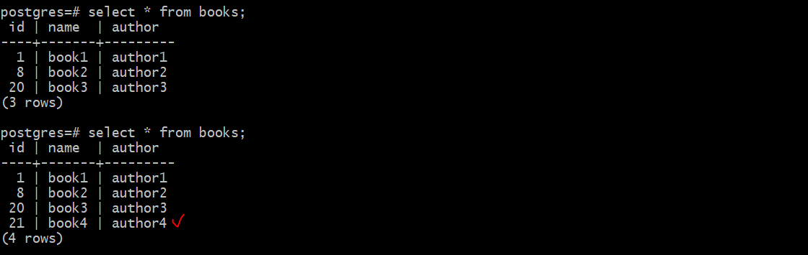

## Задача:

**2.5: Создание многоконтейнерного приложения с использованием Docker и Docker Compose**

> Цель этой задачи - создать многоконтейнерное приложение с помощью Docker и Docker Compose, а также научиться управлять его контейнерами.
> - Установка Docker и Docker Compose: Если у вас ещё не установлены Docker и Docker Compose, установите их на вашем компьютере.
> - Создание многоконтейнерного приложения: Создайте простое многоконтейнерное приложение, состоящее из двух контейнеров: 
веб-приложение и база данных. Вы можете использовать готовые образы (например, nginx и postgres), или создать собственные
Dockerfile для каждого контейнера.
> - Настройка Docker Compose: Создайте файл docker-compose.yml, в котором опишите конфигурацию вашего многоконтейнерного приложения. 
Укажите сервисы (контейнеры), их зависимости, порты, и другие параметры.
> - Запуск приложения: Используйте команду docker-compose up для запуска вашего многоконтейнерного приложения. Убедитесь, что все контейнеры успешно запущены и могут взаимодействовать друг с другом.
> - Проверка веб-приложения: В откройте веб-браузере страницу вашего веб-приложения, которое работает в контейнере. Убедитесь, что оно доступно и функционирует корректно.
> - Логирование: Ведите лог своих действий и операций, выполненных с использованием Docker и Docker Compose.
> - Управление контейнерами: Остановите и удалите контейнеры с помощью команды docker-compose down. Затем снова запустите их с помощью docker-compose up.
> - Отчет: Подготовьте отчет, описывающий все действия, выполненные вами при создании и управлении многоконтейнерным приложением с использованием Docker и Docker Compose. Укажите, какие команды и конфигурации использовались, и какие результаты были получены. Также укажите, если возникли какие-либо проблемы и как вы их решали.


## Решение:

Для решение этой задачи создал простое много контейнерное приложение состоящие из веб-приложения nginx, backend из python и базы данных postgress. Это маленькое веб приложение для ведения учета книг, в котором реализовано добавление новых книг, обновление и показ список всех имеющих книг в БД.

**Структура:**


Начнем с базы данных. В качестве СУБД использоваль Postgress.

Сперва, подготовил БД для контейнера на тестовой среде. Для этого сделал python скрипт initdb_app.py которое создает простое БД, таблицу и после заполняем их несколькими данными и сделал его дамп db_backup.sql, который позже добавим в postgress докер образ.

```
pg_dump postgres > /db/db_backup.sql # backup postgres DB
```

Создаем Докер файл для БД

nano db/Dockerfile
```
FROM postgres:16
ADD db_backup.sql docker-entrypoint-initdb.d/db_backup.sql 
```

Докер файл для python приложение 

nano app/Dockerfile
```
FROM python:3.8-alpine

RUN pip install --upgrade pip 
RUN apk add curl --no-cache # for health checks 
RUN addgroup -S webapp && adduser -S -G webapp webapp # -r creates system accounts

COPY requirements.txt requirements.txt
RUN pip install --no-cache-dir -r requirements.txt 

WORKDIR /app
COPY . /app/
VOLUME [ "/app" ]

USER webapp
EXPOSE 5000
CMD ["python3", "app.py"]
```
Докерфайл для nginx контейнера

nano web/Dockerfile
```
FROM nginx:stable-alpine
RUN apk add curl --no-cache # for health checks
COPY nginx.conf /etc/nginx/nginx.conf
EXPOSE 80
```

Создаем docker compose для управление контейнерами. Использовал secret для хранения пароля от postgress, переменных значений для БД и healthcheck для проверки рабочего состояния контейнеров. И создал две разные подсети, один для frontend и второй для backend контейнеров.

nano docker-compose.yml
```
version: '3.7'
services:  
  web:
    build:
      context: ./web  
    image: dvsp-web:${imageverion}
    container_name: web
    networks:
      - frontend 
    volumes:
      - ./web/nginx.conf:/etc/nginx/nginx.conf:ro
    ports:
      - 80:80
    depends_on: 
      - app
    healthcheck:
      test: ["CMD-SHELL", "curl --silent --fail localhost:80/web_health_check || exit 1"] # -s makes curl quite, no-error-message; -f no output-at-all
      interval: 10s
      timeout: 10s
      retries: 3

  app:
    build:
      context: ./app
    image: dvsp-app:${imageverion}
    container_name: app
    expose:
      - 5000
    volumes:
      - ./app:/app
    depends_on:
      postgres:
        condition: service_healthy
    healthcheck:
      test: ["CMD-SHELL", "curl --silent --fail localhost:5000/app_health_check || exit 1"] 
      interval: 10s
      timeout: 10s
      retries: 3

    networks:
      - backend
      - frontend

  postgres:
    build:
      context: ./db
    image: dvsp-db:${imageverion}    
    container_name: postgres
    secrets:
      - db_password
    environment:
      - POSTGRES_DB=${POSTGRES_DB}
      - POSTGRES_USER=${POSTGRES_USER}  
      - POSTGRES_PASSWORD_FILE=/run/secrets/db_password   
    volumes:
      - db-data:/var/lib/postgresql/data
    expose:
      - 5432    
    healthcheck:
      test: ["CMD", "pg_isready"]
      interval: 10s
      timeout: 5s
      retries: 5      
    networks:
      backend: 
        ipv4_address: 192.168.10.254

volumes:
  db-data:

secrets: 
  db_password:
    file: ./db/db_password.txt

networks:
  backend:
    ipam:
      driver: default
      config:
        - subnet: 192.168.10.0/24
          gateway: 192.168.10.1
  frontend:
    ipam:
      driver: default
      config:
        - subnet: 192.168.20.0/24
          gateway: 192.168.20.1

# docker compose config
# docker compose build
# docker history dvsp-db:v1
# docker compose up -d
```

nano .env
```
POSTGRES_DB=postgres
POSTGRES_USER=postgres
imageverion=v1
```

# Результат:

**Создаем docker образы**


**Запускаем контейнеры**


**Список книг**


**Добавляем новую книгу**




### Приложение работает. Связ между контейнерами успешно установлен.


