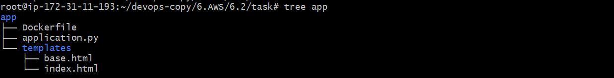

## Практические задания - часть 2 — Работа с контейнерами

###  Установите и настройте EB CLI

Установка EB CLI 

```
apt update
apt install python3-virtualenv
virtualenv --version

git clone https://github.com/aws/aws-elastic-beanstalk-cli-setup.git
python3 ./aws-elastic-beanstalk-cli-setup/scripts/ebcli_installer.py

export PATH="/root/.ebcli-virtual-env/executables:$PATH"
echo 'export PATH="/root/.ebcli-virtual-env/executables:$PATH"' >> ~/.bash_profile 
source ~/.bash_profile

# nano /root/.ebcli-virtual-env/executables/eb -> #!/usr/bin/env python3
eb --version
```
- https://docs.aws.amazon.com/elasticbeanstalk/latest/dg/eb-cli3-install.html 
- https://github.com/aws/aws-elastic-beanstalk-cli-setup 


- Создайте приложение и окружение, используя Dockerrun.aws.json v2

nano Dockerrun.aws.json

```
{
    "AWSEBDockerrunVersion": 2,
    "containerDefinitions": [
        {
            "name": "proxy",
            "image": "mrdockernnm/proxy:eb",
            "essential": true,
            "memory": 128,
            "portMappings": [
                {
                    "hostPort": 80,
                    "containerPort": 80
                }
            ],
            "links": [
                "app"
            ]
        },
        {
            "name": "app",
            "image": "mrdockernnm/app:eb",
            "memory": 128,
            "essential": true,
            "portMappings": [
                {
                    "containerPort": 3000,
                    "hostPort": 3000
                }
            ]
        }
    ]
}
```

- создайте 2 контейнера:
  - Nginx
  - Rails (можно использовать приложение на другом языке программирования, который поддерживает EB, но следующие подпункты обязательны) -> я использовал python
- Установите на rails порт 3000 и настройте nginx на фронт 
- Создайте простое Rails приложение выводящее строку "Hello world"
 
В качестве приложение использовал python, порт 3000



Создаем образ для приложения и сохраним в docker hub

nano Dockerfile
```
FROM python:3.8-alpine
RUN pip install flask
WORKDIR /app
COPY . /app/
EXPOSE 3000
CMD ["python3", "application.py"]
```

```
docker build -t mrdockernnm/app:eb .
docker push mrdockernnm/app:eb
```
Создаем докер образ для nginx proxy и его тоже храним в docker hub


nano Dockerfile
```
FROM nginx:stable-alpine
COPY nginx.conf /etc/nginx/nginx.conf
EXPOSE 80
```

nano nginx.conf
```
http {  
    server{        
        listen *:80;
        location / {
            proxy_pass http://backend;
        }
    }
    upstream backend {
        server app:3000;
    } 
}
events {}
```

```
docker build -t mrdockernnm/proxy:eb
docker push mrdockernnm/proxy:eb
```

Инициализируем приложение и создаем среду, выбрал платформу  ECS running on 64bit Amazon Linux 2023 для работы с мульти контейнером (предварительно надо настроит aws access/keys)

```
eb init ebs-app --region us-east-2 --platform "ECS running on 64bit Amazon Linux 2023"
eb create ebs-app-aaa
```


`eb health`


## Результат:

- Проверьте используя URL: <имя_приложения>.<регион>.elasticbeanstalk.com работу beanstalk, вы должны увидеть содержимое index.html


